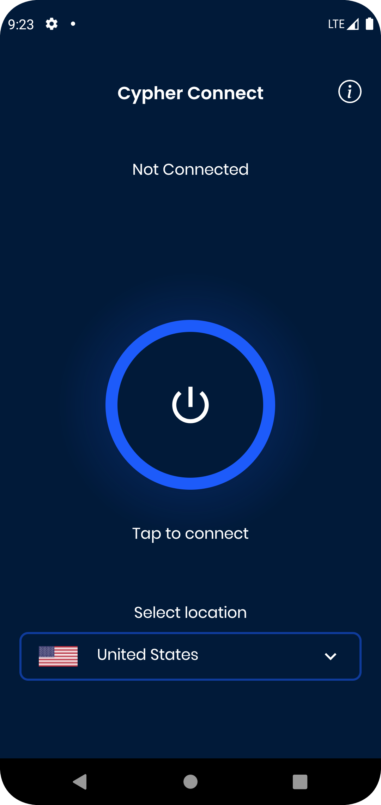

# Cypher Connect

Cypher Connect is an android VPN software that helps bypass firewalls and internet censorship. Cypher Connect uses the popular [Shadowsocks](https://shadowsocks.org) protocol to encrypt your internet traffic and route it through a proxy server. 

<table><tr>
    <td></td>
    <td></td>
    <td></td>
    <td></td>
</tr></table>